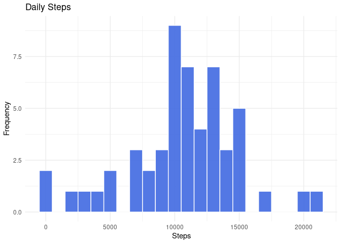
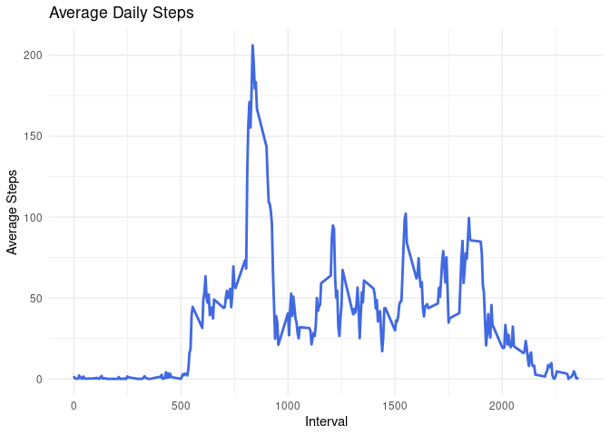
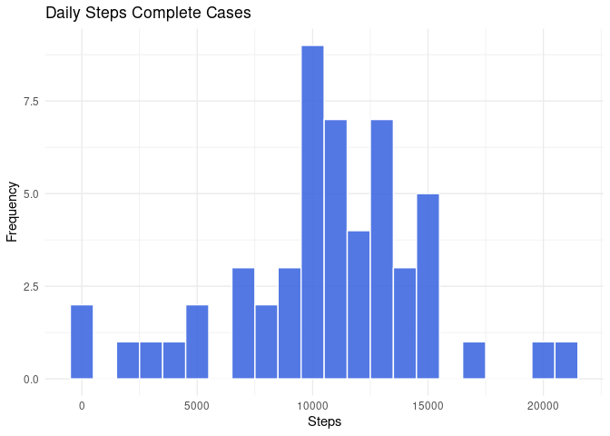
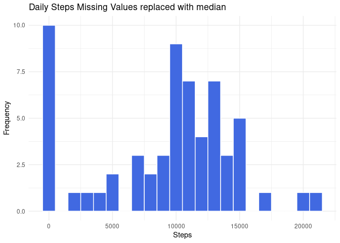
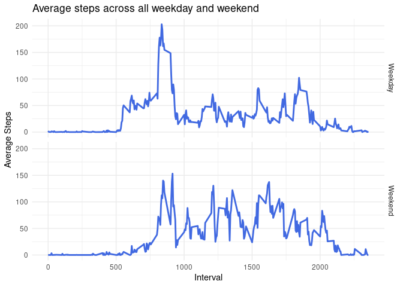

## Introduction

It is now possible to collect a large amount of data about personal movement using activity monitoring devices such as a [Fitbit](https://www.fitbit.com), Nike Fuelband[^1], or Jawbone Up[^2]. These type of devices are part of the “quantified self” movement – a group of enthusiasts who take measurements about themselves regularly to improve their health, to find patterns in their behavior, or because they are tech geeks. But these data remain under-utilized both because the raw data are hard to obtain and there is a lack of statistical methods and software for processing and interpreting the data.

[^1]: Production stopped in 2015, support stopped in 2018; more about Fuelband [Wiki](https://en.wikipedia.org/wiki/Nike%2B_FuelBand)
[^2]: Business shutted down in 2017 [Business Insider](https://www.businessinsider.com/jawbone-shutting-down-liquidating-assets-2017-7?r=DE&IR=T)


This assignment makes use of data from a personal activity monitoring device. This device collects data at 5 minute intervals through out the day. The data consists of two months of data from an anonymous individual collected during the months of October and November, 2012 and include the number of steps taken in 5 minute intervals each day.

The data for this assignment can be downloaded from the course web site:

* Dataset: [Activity monitoring data](https://d396qusza40orc.cloudfront.net/repdata%2Fdata%2Factivity.zip) [52K]


This is The variables included in this dataset are:

* **steps**: Number of steps taking in a 5-minute interval (missing values are coded as NA\color{red}{\verb|NA|}NA)
* **date**: The date on which the measurement was taken in YYYY-MM-DD format
* **interval**: Identifier for the 5-minute interval in which measurement was taken

The dataset is stored in a comma-separated-value (CSV) file and there are a total of 17,568 observations in this dataset.

****  
## Loading packages  

```r
library(tidyverse)
library(ggplot2)
```
***

## Loading and processing data 


Dowload and unzip the File:  

```r
fileURL <- "https://d396qusza40orc.cloudfront.net/repdata%2Fdata%2Factivity.zip"
download.file(fileURL, destfile = "./Factivity.zip")
unzip("Factivity.zip")
```

Loading the data and a quick check of the summary and data:

```r
df <- read.csv("activity.csv")
summary(df)
```

```
##      steps            date              interval     
##  Min.   :  0.00   Length:17568       Min.   :   0.0  
##  1st Qu.:  0.00   Class :character   1st Qu.: 588.8  
##  Median :  0.00   Mode  :character   Median :1177.5  
##  Mean   : 37.38                      Mean   :1177.5  
##  3rd Qu.: 12.00                      3rd Qu.:1766.2  
##  Max.   :806.00                      Max.   :2355.0  
##  NA's   :2304
```

```r
head(df, 10)
```

```
##    steps       date interval
## 1     NA 2012-10-01        0
## 2     NA 2012-10-01        5
## 3     NA 2012-10-01       10
## 4     NA 2012-10-01       15
## 5     NA 2012-10-01       20
## 6     NA 2012-10-01       25
## 7     NA 2012-10-01       30
## 8     NA 2012-10-01       35
## 9     NA 2012-10-01       40
## 10    NA 2012-10-01       45
```

Change the the variable to the class Date:

```r
df$date <- as.Date(df$date)
```
***


## What is the mean total number of steps taken per day?

Calculate the total number of steps taken per day and plot the histogram.

```r
totalsteps <- df %>% 
    group_by(date) %>% 
    summarise(Steps = sum(steps))

ggplot(totalsteps, aes(Steps)) +
    geom_histogram(binwidth = 1000, fill = "royalblue", color="white", alpha = 0.9) +
    labs(title = "Daily Steps", x = "Steps", y = "Frequency") +
    theme_minimal()
```

```
## Warning: Removed 8 rows containing non-finite values (stat_bin).
```

<!-- -->

***

Calculate the mean and median number of steps.

```r
knitr::kable(totalsteps %>% 
    select(Steps) %>% 
    summarise_all(list(Mean_steps = mean, Median_steps = median), na.rm = TRUE), "pipe")
```


| Mean_steps| Median_steps|
|----------:|------------:|
|   10766.19|        10765|

***


## What is the average daily activity pattern?

Calculate the average number of steps taken and make a time series plot.

```r
totalinterval <- df %>% 
    group_by(interval) %>% 
    summarise(Average = mean(steps, na.rm = TRUE))

ggplot(totalinterval, aes(x = interval, y = Average)) +
    geom_line(colour = "royalblue", size = 1) +
    labs(title = "Average Daily Steps", x = "Interval", y = "Average Steps") +
    theme_minimal()
```

<!-- -->

***

The 5-minute interval, that, on average, contains the maximum number of steps


```r
totalinterval[which.max(totalinterval$Average), ]
```

```
## # A tibble: 1 x 2
##   interval Average
##      <int>   <dbl>
## 1      835    206.
```

***

## Code to describe and show a strategy for imputing missing data & 

**1.** The number of missing values in the dataset.

```r
colSums(is.na(df))
```

```
##    steps     date interval 
##     2304        0        0
```

```r
colSums(is.na(df)) / nrow(df)
```

```
##     steps      date  interval 
## 0.1311475 0.0000000 0.0000000
```
13% of the entries of the variable *steps* are missing value. All other variables do not contain missing values.  
  
**2.** One of the strategies of dealing with missing values is listwise deletion. Which means, all cases with a missing value will be deleted.

```r
df %>% 
    drop_na() %>% 
    group_by(date) %>% 
    summarise(Steps = sum(steps)) %>% 
    ggplot(aes(Steps)) +
    geom_histogram(binwidth = 1000, fill = "royalblue", color = "white", alpha = 0.9)+
    labs(title = "Daily Steps Complete Cases", x = "Steps", y = "Frequency") +
    theme_minimal()
```

<!-- -->

In this case, the effect on the histogram is not very large, since some stats in ggplot requires complete data, missing values will be automatically removed with a warning. This warning is visible at the first histogram.  
  
A second strategy is to replace the missing values with the mean or median of that variable. In the case of imputation with median, the effect is clearer.

```r
df %>% 
    mutate_at(vars(steps), ~ifelse(is.na(.x), median(.x, na.rm = TRUE), .x)) %>% 
    group_by(date) %>% 
    summarise(Steps = sum(steps)) %>% 
    ggplot(aes(Steps)) +
    geom_histogram(binwidth = 1000, fill = "royalblue", color = "white", alpha = TRUE) +
    labs(title = "Daily Steps Missing Values replaced with median", x = "Steps", y = "Frequency") +
    theme_minimal()
```

<!-- -->

**3.** Creating a new dataset that is equal to the original dataset but with the missing data filled in.


```r
df_filled <- df %>%  
    mutate_at(vars(steps), ~ifelse(is.na(.x), median(.x, na.rm = TRUE), .x))
head(df_filled, 10)
```

```
##    steps       date interval
## 1      0 2012-10-01        0
## 2      0 2012-10-01        5
## 3      0 2012-10-01       10
## 4      0 2012-10-01       15
## 5      0 2012-10-01       20
## 6      0 2012-10-01       25
## 7      0 2012-10-01       30
## 8      0 2012-10-01       35
## 9      0 2012-10-01       40
## 10     0 2012-10-01       45
```

**4.** Calculate and report the mean and median total number of steps taken per day.
  
If the missing values are deleted, there is no effect compared to the calculation at the beginning. If, on the other hand, the missing values are replaced with the median, the mean decreases significantly and the median shifts.
  
The result of the complete cases:

 Mean_steps   Median_steps
-----------  -------------
   10766.19          10765


The result of replacing the missing values with median:

 Mean_steps   Median_steps
-----------  -------------
    9354.23          10395
  
***


## Are there differences in activity patterns between weekdays and weekends?

Create a factor variable which shows whether the date is a weekday or a weekend.

```r
df_filled$day <- as.factor(if_else(weekdays(df_filled$date, abbreviate = TRUE) %in% c("Sa", "So"), "Weekend", "Weekday"))
```
  
Creating a a panel containing a time series of the 5-minute intervall and average number of steps across all weekday days and weekend days.

```r
df_filled %>% 
    group_by(interval, day) %>% 
    summarise(Average = mean(steps)) %>% 
    ggplot(aes(x = interval, y = Average)) +
    geom_line(colour = "royalblue", size = 1) +
    facet_grid(vars(day)) +
    labs(title = "Average steps across all weekday and weekend", x = "Interval", y = "Average Steps") +
    theme_minimal()
```

<!-- -->
